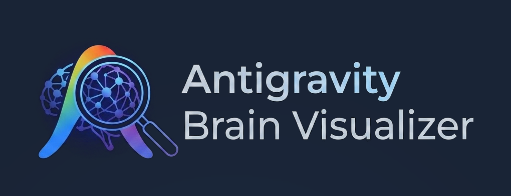
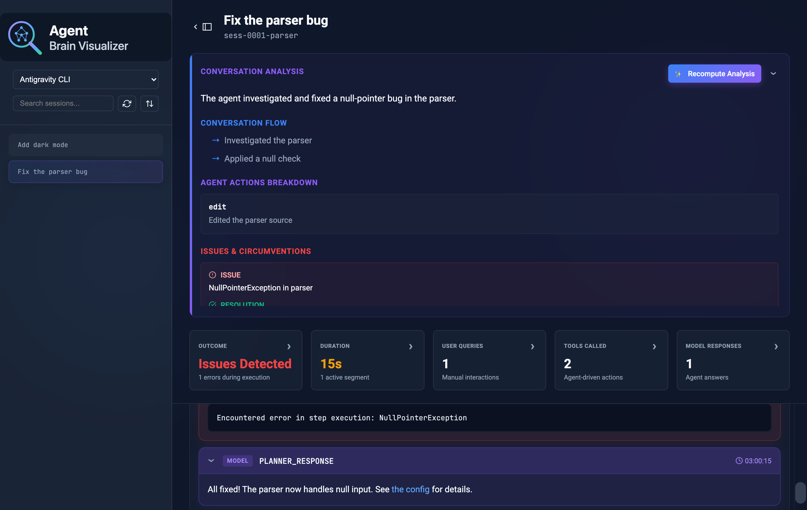

<p align="center">
  
</p>

# Antigravity Brain Visualizer

<p align="center">
  
</p>

## What is this project?
The Antigravity Brain Visualizer is a dedicated companion tool for developers working with Antigravity AI agents. Antigravity agents construct complex reasoning chains, dispatch background tasks, spawn subagents, and execute system commands over long-running sessions. The agent records all of these interactions in detailed JSONL transcript files (the agent's "brain"). 

This visualizer parses those raw JSONL brain transcripts and renders them in a scannable and interactive web interface, allowing developers to inspect the agent's exact decision-making process.

## How it works
The visualizer automatically scans your local filesystem for agent session transcripts. When you select a conversation session from the sidebar, the application parses the JSONL steps and visually organizes the execution flow into interactive sequences. 

Additionally, it leverages Google's Gemini LLMs to automatically generate comprehensive executive summaries of long conversations—distilling thousands of lines of transcript into the core user intent, key technical decisions, and the final outcome of the session.

> [!NOTE]
> **Filesystem Modifications:** When you generate an AI summary for a session, the visualizer caches the result by creating a `summary.json` file and a `short_title.txt` file directly inside that specific agent's `.gemini/brain` directory. This prevents redundant LLM calls and speeds up future loads.

### Key Features

**Session Management**
*   **Session Loading**: Parses local `.gemini/brain` directories to list past and active agent sessions.
*   **Multiple Sources**: In addition to Antigravity transcripts, the dropdown can render **OpenAI Codex** CLI sessions read from `~/.codex/sessions` (select "OpenAI Codex"). Codex rollout files are adapted into the same timeline view. *(AI summarization currently applies to Antigravity transcripts.)*
*   **Search & Filtering**: Includes a text search input to find sessions, and a dropdown to filter sessions by source/agent type (Antigravity CLI, IDE, Agent, or OpenAI Codex).
*   **Sorting & Refreshing**: Provides toggle controls to sort sessions chronologically and a refresh button to load new sessions.
*   **Session Metadata**: Hovering over a session displays an overview popover containing metadata such as step counts and session IDs.
*   **Adjustable Layout**: The sidebar features a drag handle to resize its width or collapse it entirely.

**Timeline & Navigation**
*   **Proportional Timeline**: Displays a visual bar representing the elapsed wall-clock duration of the session, mapping active sequences and idle gaps proportionally.
*   **Viewport Tracking**: A translucent indicator moves across the timeline to highlight the exact time span of the transcript steps currently visible on the screen.
*   **Interactive Scrubbing**: Clicking the timeline auto-scrolls the transcript to the corresponding chronological point.
*   **Duration Metrics**: Hovering over timeline segments displays start/end timestamps and elapsed durations.

**Transcript Rendering**
*   **Sequence Grouping**: Raw JSONL steps are grouped into collapsible sequences triggered by user inputs, displaying the calculated wall-clock duration of each sequence.
*   **Step Formatting**: Steps are formatted as individual UI cards depending on their actor (User, Model, Tool, System), with syntax highlighting for code and tool outputs.

**Content Filtering & Search**
*   **Step Filtering**: Toggles to show or hide specific step types (User Queries, Tool Calls, Errors, Model Responses). Empty sequence containers are automatically hidden when filters are applied.
*   **In-Transcript Search**: A find-in-page text search utility to navigate through text matches within the active transcript.

**AI Summarization**
*   **Backend Integration**: The Micronaut backend integrates with Google Gemini via LangChain4j.
*   **Session Summaries**: Analyzes raw JSONL transcripts via LLM to generate a high-level overview of the agent's actions and outcomes.
*   **Summary Panel**: The generated summary is injected into a collapsible panel at the top of the transcript view.

## Technology Stack & Implementation
This project prioritizes a lightweight, high-performance, and maintainable architecture:

- **Backend**: Built with [Micronaut](https://micronaut.io/) (Java). It serves the frontend static assets and provides native REST APIs to securely read and parse the local file-system transcripts.
- **AI Integration**: Powered by [LangChain4j](https://github.com/langchain4j/langchain4j) connecting directly to [Google Gemini models](https://docs.langchain4j.dev/integrations/language-models/google-genai/). It uses chunking and recursive consolidation to process large transcript files that exceed standard token limits.
- **Frontend**: A zero-build Vanilla JavaScript, HTML, and CSS single-page application. It avoids heavy framework overhead, relying instead on standard browser DOM APIs, customized CSS grid/flexbox layouts, and minimal dependencies (`marked.js` and `highlight.js`) for efficient rendering and responsiveness.

## Installation

The easiest way to install and use the Antigravity Brain Visualizer is to download the pre-compiled native executable for your operating system.

1. Navigate to the [Releases](https://github.com/glaforge/antigravity-brain-visualizer/releases) section of this repository.
2. Download the appropriate `.zip` asset for your OS (macOS, Linux, or Windows).
3. Unzip the downloaded file.
4. Make the extracted file executable if necessary (e.g., `chmod +x agy-brain-viz`).
5. Run it directly from your terminal.
6. Open your web browser and navigate to [http://localhost:8080](http://localhost:8080) to view the interface.

Alternatively, you can clone this repository and run or build it locally from source.

## Running the Application (from Sources)

The transcript analysis can be powered by either the remote **Google Gemini** API (default) or a
**local model served by [Ollama](https://ollama.com/)** (e.g. Gemma) — no API key or network
required.

### Option A — Gemini (default)

To run with the hosted Gemini model, provide your API key:

```bash
export GEMINI_API_KEY="your-api-key-here"
./gradlew run
```

### Option B — Local model via Ollama

Pull a model and make sure Ollama is running (`ollama serve`), then start the app with
`AI_PROVIDER=ollama`:

```bash
ollama pull gemma4            # or any Gemma tag you prefer
export AI_PROVIDER=ollama
export OLLAMA_MODEL=gemma4    # optional; defaults to gemma4
./gradlew run
```

No `GEMINI_API_KEY` is needed in this mode.

#### AI configuration reference

| Variable          | Applies to | Default                  | Description                                  |
| ----------------- | ---------- | ------------------------ | -------------------------------------------- |
| `AI_PROVIDER`     | both       | `gemini`                 | `gemini` or `ollama`                         |
| `GEMINI_API_KEY`  | gemini     | _(required for gemini)_  | Google Gemini API key                        |
| `GEMINI_MODEL`    | gemini     | `gemini-3.5-flash`       | Gemini model name                            |
| `OLLAMA_BASE_URL` | ollama     | `http://localhost:11434` | Ollama server URL                            |
| `OLLAMA_MODEL`    | ollama     | `gemma4`                 | Local model tag to use                       |

Once the server starts, open your web browser and navigate to [http://localhost:8080](http://localhost:8080) to interact with the visualizer.

### Customizing the Port

If you need to run the application on a different port, you can override it using the `MICRONAUT_SERVER_PORT` environment variable:

```bash
export MICRONAUT_SERVER_PORT=9090
export GEMINI_API_KEY="your-api-key-here"
./gradlew run
```

*(If you are running the compiled native executable directly, you can also append `-Dmicronaut.server.port=9090` to the command).*

## Building a Native Executable

Because this project is built with Micronaut, you can compile it into a highly-optimized, standalone native executable using GraalVM. 

1. Ensure you have [GraalVM](https://www.graalvm.org/) installed and set up as your active Java environment.
2. Run the native compilation task:

```bash
./gradlew nativeCompile
```

This generates a native executable in the `build/native/nativeCompile/` directory. You can run it directly:

```bash
export GEMINI_API_KEY="your-api-key-here"
./build/native/nativeCompile/agy-brain-viz
```

*(Note: Start-up times will be practically instantaneous compared to the standard JVM version).*

## License
This project is licensed under the Apache 2.0 License. See the [LICENSE](../LICENSE) file for details.

## Disclaimer
This is not an officially supported Google product.
