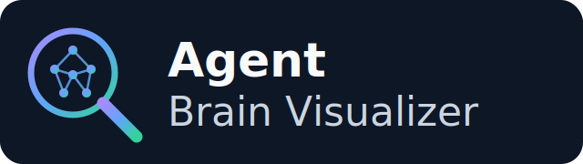

<p align="center">
  
</p>

# Agent Brain Visualizer

<p align="center">
  
</p>

## What is this project?
The Agent Brain Visualizer is a dedicated companion tool for developers working with AI coding agents. Agents construct complex reasoning chains, dispatch background tasks, spawn subagents, and execute system commands over long-running sessions, recording all of these interactions in detailed JSONL transcript files (the agent's "brain"). It reads sessions from Antigravity (CLI/IDE/Agent), OpenAI Codex, and Claude Code.

This visualizer parses those raw JSONL brain transcripts and renders them in a scannable and interactive web interface, allowing developers to inspect the agent's exact decision-making process.

## How it works
The visualizer reads agent sessions from a shared [Postgres store](#the-trajectory-store--postgres). Trajectories get there by being **pushed**: the [`agent-ingest`](cli/README.md) CLI scans a machine's local transcripts (Antigravity, OpenAI Codex, Claude Code) and uploads them to the app, which normalizes and stores them. So a session captured on one computer is visible from any machine pointed at the same store. When you select a session from the sidebar, the application renders its normalized steps into interactive sequences.

Additionally, it leverages Google's Gemini LLMs to automatically generate comprehensive executive summaries of long conversations—distilling thousands of lines of transcript into the core user intent, key technical decisions, and the final outcome of the session. These summaries are cached in the store, so a summary generated on one machine is available on the others.

### Key Features

**Session Management**
*   **Session Loading**: Lists the ingested sessions for the selected source from the store, newest first.
*   **Multiple Sources**: Antigravity (`antigravity-cli` / `antigravity-ide`), **OpenAI Codex**, and **Claude Code** sessions are all ingested into the same store and rendered in one timeline view. The `agent-ingest` CLI locates each tool's transcripts (`~/.gemini`, `~/.codex/sessions`, `~/.claude/projects`) and pushes them; the server normalizes each tool's format into the shared step schema and caches AI summaries alongside them.
    > **Note:** Inline file preview is available for Antigravity transcripts, which embed explicit file references. Codex and Claude Code sessions reference files through shell/tool calls rather than the structured `file://` links Antigravity emits, so clickable file previews are not generated for them.
*   **Fleet Insights**: A **📊 Insights** button opens a cross-session dashboard for the selected source — session/outcome counts, busiest tools, the most common errors, average tool calls and duration, and a rolled-up backlog of the recommendations and issues surfaced by the per-session AI analyses. Every tally row is **drill-down**: click it to see (and open) the sessions behind it.
*   **Skill / AGENTS.md Miner**: A **🛠️ Mine** button turns the corpus into reusable assets — it mines recurring tool-call workflows and failure→fix patterns across sessions and (when AI is configured) proposes concrete **skills**, **AGENTS.md rules**, and tooling gaps, each downloadable as a drop-in `SKILL.md` / `AGENTS.md` file.
*   **Analysis Eval**: A **🧪 Eval** button scores the quality of the AI analyses with six deterministic checks (schema completeness, actionability, conciseness, non-degeneracy, error coverage), plus an opt-in **LLM-as-judge panel** (strict/balanced/pragmatic lenses, averaged, with the panel's spread shown). Runs are **savable** into a history you can delete, **A/B compare**, chart (score + per-check sparklines), and export to **CSV**.
*   **Prompt Lab**: A **🔬 Prompt Lab** button closes the loop — edit two analysis prompt variants, and it re-analyzes a small sample of sessions with each and scores them with the deterministic eval (the eval is the fitness function), showing which prompt wins.
*   **Search & Filtering**: Includes a text search input to find sessions, and a dropdown to filter sessions by source/agent type (Antigravity CLI, IDE, Agent, OpenAI Codex, or Claude Code).
*   **Sorting & Refreshing**: Provides toggle controls to sort sessions chronologically and a refresh button to load new sessions.
*   **Session Metadata**: Hovering over a session displays an overview popover containing metadata such as step counts and session IDs.
*   **Adjustable Layout**: The sidebar features a drag handle to resize its width or collapse it entirely.

**Timeline & Navigation**
*   **Proportional Timeline**: Displays a visual bar representing the elapsed wall-clock duration of the session, mapping active sequences and idle gaps proportionally.
*   **Viewport Tracking**: A translucent indicator moves across the timeline to highlight the exact time span of the transcript steps currently visible on the screen.
*   **Interactive Scrubbing**: Clicking the timeline auto-scrolls the transcript to the corresponding chronological point.
*   **Duration Metrics**: Hovering over timeline segments displays start/end timestamps and elapsed durations.

**Transcript Rendering**
*   **Sequence Grouping**: Raw JSONL steps are grouped into collapsible sequences triggered by user inputs, displaying the calculated wall-clock duration of each sequence.
*   **Step Formatting**: Steps are formatted as individual UI cards depending on their actor (User, Model, Tool, System), with syntax highlighting for code and tool outputs.

**Content Filtering & Search**
*   **Step Filtering**: Toggles to show or hide specific step types (User Queries, Tool Calls, Errors, Model Responses). Empty sequence containers are automatically hidden when filters are applied.
*   **In-Transcript Search**: A find-in-page text search utility to navigate through text matches within the active transcript.

**AI Summarization**
*   **Backend Integration**: The Micronaut backend integrates with an LLM via LangChain4j — either the hosted **Google Gemini** API or a **local Ollama** model (see [Running the Application](#running-the-application-from-sources)).
*   **Session Summaries**: Analyzes raw JSONL transcripts via LLM to generate a high-level overview of the agent's actions and outcomes.
*   **Summary Panel**: The generated summary is injected into a collapsible panel at the top of the transcript view.

## Technology Stack & Implementation
This project prioritizes a lightweight, high-performance, and maintainable architecture:

- **Backend**: Built with [Micronaut](https://micronaut.io/) (Java). It serves the frontend static assets, receives pushed trajectories at its ingest API (normalizing each tool's format into a shared schema), and serves the session list, transcripts, and analyses from a Postgres store via plain JDBC.
- **AI Integration**: Powered by [LangChain4j](https://github.com/langchain4j/langchain4j) connecting directly to [Google Gemini models](https://docs.langchain4j.dev/integrations/language-models/google-genai/). It uses chunking and recursive consolidation to process large transcript files that exceed standard token limits.
- **Frontend**: A zero-build Vanilla JavaScript, HTML, and CSS single-page application. It avoids heavy framework overhead, relying instead on standard browser DOM APIs, customized CSS grid/flexbox layouts, and minimal dependencies (`marked.js` and `highlight.js`) for efficient rendering and responsiveness.

## Installation

The easiest way to install and use the Agent Brain Visualizer is to download the pre-compiled native executable for your operating system.

1. Navigate to the [Releases](https://github.com/glaforge/antigravity-brain-visualizer/releases) section of this repository.
2. Download the appropriate `.zip` asset for your OS (macOS, Linux, or Windows).
3. Unzip the downloaded file.
4. Make the extracted file executable if necessary (e.g., `chmod +x agy-brain-viz`).
5. Run it directly from your terminal.
6. Open your web browser and navigate to [http://localhost:8080](http://localhost:8080) to view the interface.

Alternatively, you can clone this repository and run or build it locally from source.

## Running the Application (from Sources)

### Prerequisites

Building from source requires **Java 25** — the Micronaut 5 Gradle plugins and the project's source
level both need it. The repo pins the JDK with [`mise`](https://mise.jdx.dev/) (see `mise.toml`):

```bash
mise install    # provisions temurin-25 once
```

With `mise` active, `./gradlew …` automatically uses Java 25. If you don't use `mise`, put a Java 25
JDK on your `PATH`, or prefix Gradle commands with `mise exec -- ` (e.g. `mise exec -- ./gradlew run`).
Running an older JDK fails at configuration time with *"Dependency requires at least JVM runtime
version 25"*. (Node.js is only needed for the frontend/e2e tests — see [Development & Tests](#development--tests).)

You also need **Docker**, for the Postgres store described next.

### The trajectory store — Postgres

Saved eval runs are kept in a Postgres database rather than on local disk, so they can be shared
across the machines you work on. Start one with the checked-in compose file:

```bash
docker compose up -d      # data persists in a named volume across restarts
```

Its credentials are the application's built-in defaults, so nothing else is needed to run locally.
To share data between machines, point each of them at one hosted Postgres (Neon, Supabase, Cloud
SQL, …) by setting `DATABASE_URL`, `POSTGRES_USER`, and `POSTGRES_PASSWORD` — see `.env.example`.

The app still starts if the database is down; it logs a warning, serves the UI, and answers the
endpoints that need the store with a `503`.

#### Pushing trajectories into the store

Trajectories get into the store by being **pushed** to the app, so any machine — and any client, in
any language — can contribute the sessions its agents recorded:

| Endpoint | Purpose |
| -------- | ------- |
| `GET /api/ingest/manifest?source=<source>` | Every stored `id → contentHash`. A client diffs against this and uploads only what changed. |
| `POST /api/ingest/sessions` | A batch of `{source, id, title?, sourceMtime, raw}`, where `raw` is the tool's own transcript. Returns `{ingested, skipped, failed}`. |

The client stays thin: it locates transcripts, reads them, and reports when they changed. **The
server does the parsing**, reusing the same adapters the UI relies on, so a client never has to
understand Antigravity's, Codex's, or Claude Code's file formats — and fixing an adapter fixes every
machine by upgrading the server alone.

Nothing duplicates. A trajectory is keyed by `(source, id)`, where the id comes from the transcript
itself (a Claude Code session UUID, a Codex rollout id, an Antigravity session directory) rather than
the path it was found at. Pushing the same session twice, or from two machines, updates one row —
and re-pushing unchanged content is a no-op the server reports as `skipped`.

These are the only endpoints that write. Set `INGEST_TOKEN` once the server is reachable from
another machine, and clients must then send `Authorization: Bearer <token>`.

> [!NOTE]
> The eval run history previously lived in `~/.agybrainviz/eval-runs.jsonl`. That file is no longer
> read, so a history saved before this change won't appear. Nothing deletes it — you can remove it
> by hand once you're happy.

### Configuration — the `.env` file

The easiest way to configure the app is to copy the checked-in sample and edit it:

```bash
cp .env.example .env    # then put your API key / provider in .env
```

The app reads `.env` from the directory you launch it from (the process's working directory), so it
works the same for `./gradlew run`, the fat jar, and the native executable. A few rules:

* **Real environment variables always win over `.env`** — export a variable to override a value for
  a single run.
* `.env` is **gitignored**, so your API key never gets committed. Only `.env.example` is tracked.
* Pass `-Ddotenv.enabled=false` to ignore the file entirely, or `-Ddotenv.path=<path>` to load it
  from somewhere else. (The test and e2e runs disable it, so a local `.env` can never change what
  the tests see.)

Prefer not to use a file? Just `export` the same variables — every option below works either way.

The transcript analysis can be powered by either the remote **Google Gemini** API (default) or a
**local model served by [Ollama](https://ollama.com/)** (e.g. Gemma) — no API key or network
required.

### Option A — Gemini (default)

Put your API key in `.env`:

```dotenv
AI_PROVIDER=gemini
GEMINI_API_KEY=your-api-key-here
```

…then start the app:

```bash
./gradlew run
```

(Equivalently: `export GEMINI_API_KEY="your-api-key-here" && ./gradlew run`.)

### Option B — Local model via Ollama

Pull a model and make sure Ollama is running (`ollama serve`), then select the provider in `.env`:

```dotenv
AI_PROVIDER=ollama
OLLAMA_MODEL=gemma4          # optional; defaults to gemma4
```

```bash
ollama pull gemma4           # or any Gemma tag you prefer
./gradlew run
```

No `GEMINI_API_KEY` is needed in this mode.

#### AI configuration reference

Every variable below can live in `.env` or be exported as an environment variable.

| Variable          | Applies to | Default                  | Description                                  |
| ----------------- | ---------- | ------------------------ | -------------------------------------------- |
| `AI_PROVIDER`     | both       | `gemini`                 | `gemini` or `ollama`                         |
| `GEMINI_API_KEY`  | gemini     | _(required for gemini)_  | Google Gemini API key                        |
| `GEMINI_MODEL`    | gemini     | `gemini-3.5-flash`       | Gemini model name                            |
| `OLLAMA_BASE_URL` | ollama     | `http://localhost:11434` | Ollama server URL                            |
| `OLLAMA_MODEL`    | ollama     | `gemma4`                 | Local model tag to use                       |

#### Store configuration reference

| Variable            | Default                                        | Description                          |
| ------------------- | ---------------------------------------------- | ------------------------------------ |
| `DATABASE_URL`      | `jdbc:postgresql://localhost:5432/agentbrainviz` | JDBC URL of the trajectory store    |
| `POSTGRES_USER`     | `agentviz`                                     | Store username                       |
| `POSTGRES_PASSWORD` | `agentviz`                                     | Store password                       |
| `INGEST_TOKEN`      | _(unset — ingest is open)_                     | Bearer token required by `/api/ingest` |

Once the server starts, open your web browser and navigate to [http://localhost:8080](http://localhost:8080) to interact with the visualizer.

### Customizing the Port

Set `MICRONAUT_SERVER_PORT` — in `.env`:

```dotenv
MICRONAUT_SERVER_PORT=9090
```

…or as an environment variable:

```bash
export MICRONAUT_SERVER_PORT=9090
./gradlew run
```

*(If you are running the compiled native executable directly, you can also append `-Dmicronaut.server.port=9090` to the command).*

## Building a Native Executable

Because this project is built with Micronaut, you can compile it into a highly-optimized, standalone native executable using GraalVM. 

1. Ensure you have [GraalVM](https://www.graalvm.org/) installed and set up as your active Java environment.
2. Run the native compilation task:

```bash
./gradlew nativeCompile
```

This generates a native executable in the `build/native/nativeCompile/` directory. Run it directly —
it picks up a `.env` from the directory you launch it from (or use environment variables):

```bash
./build/native/nativeCompile/agy-brain-viz
```

*(Note: Start-up times will be practically instantaneous compared to the standard JVM version).*

## Development & Tests

Three suites cover the app; CI runs all of them on every pull request:

```bash
mise exec -- ./gradlew build   # backend JUnit + Spotless (format check)
npm install                    # once, for the frontend/e2e tests
npm test                       # frontend unit tests (Vitest)
docker compose up -d           # the store the e2e jar talks to
mise exec -- npm run e2e       # end-to-end (Playwright) against a booted jar with seeded fixtures
```

**The tests need Docker running.** Nothing is faked: the store tests exercise a real Postgres rather
than an in-memory stand-in, because H2's Postgres mode supports neither `jsonb` nor the conditional
`ON CONFLICT … WHERE` the store relies on — an in-memory database would test something the app never
talks to.

* `./gradlew build` starts its **own** Postgres via
  [Testcontainers](https://testcontainers.com/) and applies the real `db/schema.sql` to it. It does
  not use, or care about, your `docker compose` container — a suite that passed or failed depending
  on what happened to be listening on port 5432 would be worse than no suite at all.
* `npm run e2e` boots the packaged jar, which talks to a real database, so that one **does** need
  `docker compose up -d` first. Run it under `mise exec` so the jar gets Java 25.

Code is auto-formatted by Spotless (prettier-java + prettier for JS); run `mise exec -- ./gradlew
spotlessApply` before committing.

## License
This project is licensed under the Apache 2.0 License. See the [LICENSE](../LICENSE) file for details.

## Disclaimer
This is not an officially supported Google product.
